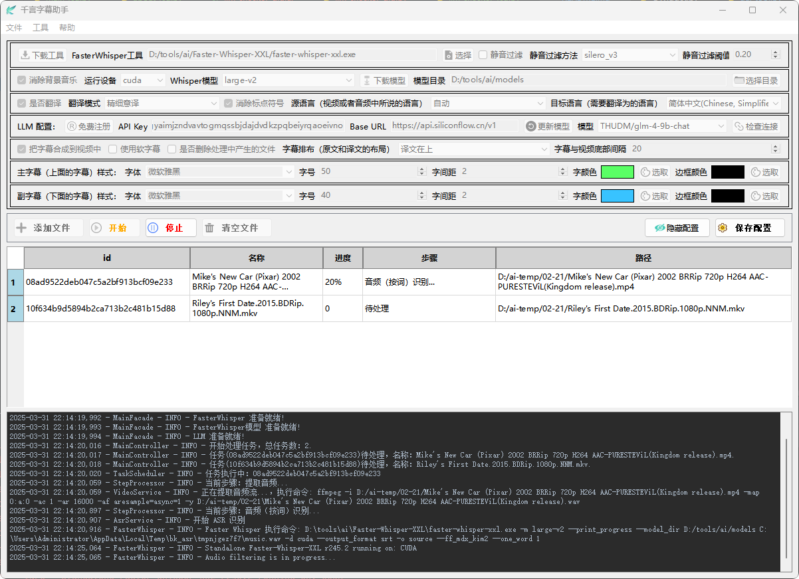

<p align="center"></p>
<h2 align="center">AI千言字幕</h2>
<h3 align="center">FasterWhisper+LLM字幕提取翻译工具</h3>
<p align="center">
  <a href="https://www.gnu.org/licenses/gpl-3.0.html#license-text">License: GPL v3</a>
</p>
<hr/>

**AI千言字幕**（AILiteSubtitler）AI字幕识别和翻译
 
- **🚀 使用FasterWhiper** 相较于OpenAI Whisper占用资源少
- **💻 自定义较高** pyqt6 GUI二次开发比较方便快速
- **🌐 源项目** 基于源项目 https://github.com/Tobin-wu/LiteSubtitler 进行了维护和二次开发
 
## v0.1.3 - 20250910
-  新增
   - 语音识别模型medium-en、large-v3-ja、large-v3-zh
   - API设置语音识别模型接口
   - 选择语音识别过滤算法时文本提示
   - 清空日志
- 优化
  - 增加AI字幕翻译每次翻译条数
  - 更新Faster-Whisper工具包：Faster-Whisper-XXL_r245.4_windows
  - 主界面和设置页面UI

## 📖1、快速开始

- **下载Window压缩包**: 解压后就可以使用；
   - Github: [Window压缩包（LiteSubtitler-window-XXX.zip 或者 LiteSubtitler-window-XXX-full.7z）](https://github.com/Tobin-wu/LiteRecorder/releases)
- **第一次使用**: 建议下载 -full.7z 版本，-full.7z 文件中打包了 FasterWhisper工具 和 small 模型，而对应的zip文件则不包括FasterWhisper工具和模型；
- **解压**: -full.7z 文件后，运行其中的 LiteSubtitler.exe 就可以；
- **升级**: 只是要下载对应版本的 ZIP文件，解压后覆盖对应文件即可；
- **编译运行**: 可以下载源代码然后自己编译运行；

## 📂2、安装后的目录结构

- 假设解压在 D:\tools\ai 目录，并且已经成功运行过（有些目录和文件是运行后生成的）。 

```
   📁 D:\tools\ai
       ├── 📄 LiteSubtitler.exe       # 应用程序
       ├── 📄 setting.json            # 配置文件
       ├── 📂 AppData
       │   └── 📂logs
       │       └── 📄 app.log         # 运行日志
       ├── 📂 Faster-Whisper-XXL      # faster-whisper工具     
       │   ├── 📄 faster-whisper-xxl.exe
       │   ├── 📄 ffmpeg.exe
       │   ├── 📄 license.txt
       │   ├── 📄 One Click Transcribe.bat
       │   └── 📂 _xxl_data
       ├── 📂 models
       │   └── 📂 faster-whisper-small   # small模型
       └── 📂 resources
           ├── 📂 images       # 使用的图片资源
           ├── 📂 prompts      # 提示语目录
           └── 📂 styles       # 全局样式
```

## 📺3、UI 展示
- 主界面
<table style="border-collapse: collapse; border: 1px solid black;">
  <tr>
    <td style="padding: 5px;background-color:#fff;"></td>
  </tr>
</table>

## ♊4、UI说明

### 4.1、FasterWhisper配置

FasterWhisper用于做语音转文字处理。

- **下载工具**: 可选功能，如果用 -full.7z 解压安装的，就不需要下载工具了；否则，在打开的网页中下载对应的版本的Faster-Whisper工具，然后解压待用。
- **选择FasterWhisper工具**: 选择下载解压时的Faster-Whisper工具（faster-whisper-xxl.exe）。
- **FasterWhisper静音过滤**: 用于过滤静音，减少幻听，但使用这个功能可能会导致字幕时间轴错乱，所以如果能不用尽量不用。
- **静音过滤方法**: 用于过滤静音的模式，不同方法的区别请查阅 Faster-Whisper VAD 的相关资料。
- **静音过滤阈值**: 多大的声音被定义为静音。
- **消除背景音乐**: 把背景音乐和人声隔离出来，提高识别效果，但可能会有一些人声被误认为是音乐。
- **运行设备**: 指定用 CPU 还是 CUDA（显卡GPU）来进行语音转文字，CUDA比CPU快5倍以上，但需要电脑有GPU的显卡。
- **Whisper模型**: 进行识别使用的模型，模型由小到大排序：small、medium、large-v1、large-v2、large-v3，理论上越大的模型效果越好，但要求的计算资源越大，处理速度越慢。
- **下载模型**: 可以让系统自动下载模型（只要选择某个Whisper模型就可以，运行过程中会下载），也可以手动下载Whisper模型：
   - 1、选择Whisper模型（假设选择的是：large-v2）。
   - 2、建立并指定模型目录（假设目录是：D:\tools\ai\models）。
   - 3、建立所择Whisper模型的子目录(根据上述假设，模型子目录应该是：D:\tools\ai\models\faster-whisper-large-v2)。
   - 4、点击“下载模型”按钮，打开FasterWhisper模型网页，files页中列出的就是faster-whisper-large-v2模型的所有文件，逐个下载并放到D:\tools\ai\models\faster-whisper-large-v2目录中。
   - 5、下载完成的large-v2目录架构应该是：
   ```
   📁 D:\tools\ai\models
       └── 📂 faster-whisper-large-v2
           ├── 📄 README.md
           ├── 📄 config.json
           ├── 📄 model.bin
           ├── 📄 tokenizer.json
           └── 📄 vocabulary.txt
   ```

#### 静音过滤方法 (VAD) 介绍
#### 总结
- **Silero VAD**：最适合在各种环境下实现高精度。
- **Pyannote VAD**：非常适合二值化和复杂的音频场景。
- **Pyannote ONNX VAD**：针对性能和跨平台使用进行了优化。
- **Auditok**：轻量级，适用于低资源环境。
- **WebRTC VAD**：非常适合实时通信应用程序。
  
#### 1. Silero VAD (silero_v3, silero_v4)
基于经过训练的深度学习模型，用于检测音频中的语音。它以其在各种声学环境下的高精度和稳健性而闻名。
- 高质量音频：适用于清晰的音频录音。
- 嘈杂环境：由于其基于多种数据集进行训练，在背景噪声环境中也能有效工作。
- 实时应用：适用于需要实时处理的应用，例如实时转录或语音助手。

#### 2. Pyannote VAD (pyannote_v3)
一款用于说话人分类和 VAD 的工具包。它使用神经网络将音频片段分类为语音或非语音。
- 语音分类任务：适用于需要说话人识别和语音检测 (VAD) 的应用。
- 研发：适用于需要灵活框架来试验 VAD 和语音分类的研究人员。
- 复杂音频场景：适用于语音重叠或多说话人场景。

#### 3. Pyannote ONNX VAD (pyannote_onnx_v3)
针对 ONNX（开放神经网络交换）优化的 Pyannote VAD 版本，可实现更快的推理速度并与各种平台兼容。
- 跨平台部署：适用于需要在不同硬件或软件环境中运行的应用程序。
- 性能关键型应用程序：适用于推理速度至关重要的场景，例如移动应用程序或边缘设备。
- 与其他 ONNX 模型集成：在将 VAD 与其他 ONNX 兼容模型结合使用以实现更复杂的工作流程时非常有用。

#### 4. Auditok
一个轻量级的 VAD 库，使用基于能量的方法来检测语音片段。与深度学习方法相比，它的计算量更低。
- 低资源环境：适用于在计算能力有限的设备上运行的应用程序。
- 简单音频处理：非常适合在精度要求不高的情况下执行的基本 VAD 任务。
- 批处理：非常适合处理大量音频文件，因为速度比精度更重要。

#### 5. WebRTC VAD
专为实时通信应用程序而设计。它使用一种简单的基于能量的算法来检测语音。
- 实时通信：非常适合 VoIP 应用程序、视频会议和其他实时音频应用程序。
- 低延迟要求：适用于对低延迟至关重要的场景，例如直播。
- 与 WebRTC 集成：非常适合已经使用 WebRTC 进行音频传输的应用程序。

#### 静音过滤阈值
-  介于0到1之间的浮点数，其中0代表最低敏感度，1代表最高敏感度。
-  区分语音与非语音时所使用的阈值。
-  设置得太低，可能会导致更多的背景噪音被误认为是语音。
-  设置得太高，则可能会漏掉一些实际的语音部分。
-  一般来说，初始设置可以尝试一个中间值（如0.5），然后根据结果进行微调。
-  清晰的录音可能可以选择较高的阈值以减少错误触发。
-  在噪音较大的环境中，可能需要降低阈值来确保捕捉到所有语音内容。


### 4.2、翻译配置

- **是否翻译**: 有时候只需要语音识别为文字，并不需要进行翻译。
- **翻译模式**: 
   - **模型直译**: 用LLM大模型进行直接翻译，不做限定和要求，都由LLM大模型自己处理。
   - **精细意译**: 要求LLM大模型在直译的基础上根据说话意思进行调整，要求遵守目标语言的习惯和表达。
   - **深思翻译**: 要求LLM大模型校正字幕，在遵守目标语言的习惯和表达的基础上，以专业的角度进行审视和调整，以求翻译结果更加精准。
- **消除标点符号**: 删除字幕中多余的标点符号。
- **源语言**: 视频或者音频中说话所用的语言，可以由系统自动识别（系统会通过音频的前30秒进行自动识别），也可以指定。自动识别支持更多的源语言（不在源语言的下拉列表中）。
- **目标语言**: 系统支持的结果语言，就是需要翻译为的语言，目前支持中文、英语、日语、韩语等十多种。

### 4.3、LLM 配置

- **免费注册**: 注册一个属于你自己的免费LLM账号（硅基流动的LLM云账号），其中有很多免费或者收费模型可以用。在打开的网页上用手机号注册即可。
- **API Key**: 调用LLM大模型进行翻译时使用的API密钥，在上一步“免费注册”中生成的密钥拷贝粘贴过来即可。
   - **生成API密钥**:
   ```
   1、免费注册硅基流动的LLM云账号之后，登录到硅基流动的工作台上。
   2、在“账户管理”中选“API密钥”。
   3、在“API密钥”页面上选择“新增API密钥”，输入密钥描述，然后“新建密钥”即可看到密钥已经生成在列表中。
   4、在列表中点击一下这个密钥，比如：sk-m*******************************************dpmd，就复制成功了。
   5、然后到千言字幕助手的页面上，粘贴到“API Key”后面的编辑框中。
   ```
- **Base URL**: LLM 大模型的地址，硅基流动的URL是：https://api.siliconflow.cn/v1
- **更新模型**: 修改了LLM模型的 API Key 或者 Base URL 之后，需要点击“更新模型”按钮来获取对应的LLM模型。
- **模型**: 可用的LLM模型，翻译使用的模型是“对话”模型（硅基流动的“模型广场”中的“对话”模型），正常情况下收费的“对话”模型都可以用来做翻译。
   - **翻译比较好的免费模型**：
   ```
   THUDM/glm-4-9b-chat
   Qwen/Qwen2.5-7B-Instruct
   THUDM/chatglm3-6b
   ```
- **检查连接**: 验证 API Key、Base URL、模型 是否正确。

### 4.4、字幕配置

- **把字幕合成到视频中**: 是否进行字幕和视频的合成处理。
- **使用软字幕**: 如果使用这个选项，就是快速把字幕附加在视频上，没有真正嵌入到视频文件中，把视频文件拷贝到其他电脑，或者投屏，可能没有字幕显示，另外，源视频已经有字幕的，采用软字幕合成会失败。如果不选用软字幕，就是硬合成，把字幕内容嵌入到视频文件中。
- **是否删除处理中产生的文件**: 处理过程中的中间文件包括：音频文件、识别文字文件，识别合并处理后的字幕文件，翻译后的字幕文件。
- **字幕排布**: 显示在视频上时，原文和译文如何排布。
- **字幕与视频底部的间隔**: 字幕显示在视频图像的什么地方。

### 4.5、主（副）字幕样式配置

- **字体**: 字幕在视频上采用的字体。
- **字号**: 字幕在视频上显示的字体大小。
- **字间距**: 字幕中字和字之间的间隔宽度。
- **字颜色**: 字幕在视频上显示的字体颜色。
- **边框颜色**: 字幕在视频上显示的字体的边框颜色。

### 4.6、操作按钮

- **添加文件**: 添加要处理的文件，支持视频文件、音频文件、字幕文件（要翻译的字幕文件）
- **开始**: 开始对列表中的文件进行处理。
- **停止**: 停止处理，停止命令发出后，将会把当前步骤执行完成才会停止。
- **清空文件**: 清空列表中的文件。
- **隐藏(显示)配置**: 隐藏或者显示上面的配置信息。
- **保存配置**: 把配置信息保存下来。另外，在开始处理时也会保存配置信息。

### 4.7、处理日志

窗口最下面部分是处理日志显示区。

## ♒5、效果

- **处理视频**：Moana.2016.avi（海洋奇缘(2016)）
- **视频时长**：01:47:12
- **电脑配置**：
   - **CPU**：AMD Ryzen 7 2700X，8核16线程
   - **显卡**：RTX3060 Ti，8G
   - **内存**：DDR4，32G
- 助手主要配置：
   - Standalone Faster-Whisper-XXL r245.2
   - **本地 Whisper 模型**: large-v2
   - **运行设备**：cuda
   - **静音过滤**：不选择
   - **消除背景音乐**：选择
   - **翻译模式**：精细意译
   - **源语言**：自动 (俄语)
   - **目标语言**：简体中文
   - **LLM配置**：硅基流动，THUDM/glm-4-9b-chat (免费)
   - **字幕合成**：硬合成到视频文件
- **处理时长**：24:54  
- **LLM费用**：0元（95340 tokens）
- **具体测试数据**：请参考 [海洋奇缘(2016)](docs/demo/Moana.2016.md)

## 🐎6、高级功能

### 6.1、限制可选的 LLM 模型

从API获取到的模型可能很多个，但并不是都适合用于翻译，但都显示在下拉列表中，不方便选择，可以用这个功能来限制下拉列表显示的模型。

- 在配置文件 setting.json 加上如下内容：
```
    "SHOW_MODELS": {
        "enabled": true,
        "models": [
            "THUDM/glm-4-9b-chat",
            "THUDM/chatglm3-6b",
            "deepseek-ai/DeepSeek-V3"
        ]
    },
```
- **enabled**：配置是否生效。
- **models**： 能用的模型。

### 6.2、修改翻译的提示语

- 修改 resources\prompts 目录下的对应文件，其中的[TargetLanguage]不能修改。
   - **摘要.txt**：提取视频摘要的提示语。
   - **翻译-模型直译.txt**：模型直译的提示语。
   - **翻译-精细意译.txt**：精细意译的提示语。
   - **翻译-深思翻译.txt**：深思翻译的提示语。

## 📝7、构建

### 7.1 下载安装工具

#### 用到的工具
- ffmpeg：https://ffmpeg.org/download.html 音视频工具
- Faster-Whisper-XXL：https://github.com/Purfview/whisper-standalone-win/releases/tag/Faster-Whisper-XXL ASR语音转文字

#### 安装ffmpeg
- 下载安装即可，然后把ffmpeg的路径配置到环境变量path中。

#### 安装Faster-Whisper-XXL
- 需要下载 GPU + CPU 版本：https://modelscope.cn/models/bkfengg/whisper-cpp/resolve/master/Faster-Whisper-XXL_r194.5_windows.7z

#### 下载 Faster-Whisper 的模型

#### faster-whisper的模型
- tiny.en: Systran/faster-whisper-tiny.en    https://hf-mirror.com/Systran/faster-whisper-tiny.en/tree/main
- tiny: Systran/faster-whisper-tiny    https://hf-mirror.com/Systran/faster-whisper-tiny/tree/main
- base.en: Systran/faster-whisper-base.en    https://hf-mirror.com/Systran/faster-whisper-base.en/tree/main
- base: Systran/faster-whisper-base    https://hf-mirror.com/Systran/faster-whisper-base/tree/main
- small.en: Systran/faster-whisper-small.en    https://hf-mirror.com/Systran/faster-whisper-small.en/tree/main
- small: Systran/faster-whisper-small    https://hf-mirror.com/Systran/faster-whisper-small/tree/main
- medium.en: Systran/faster-whisper-medium.en    https://hf-mirror.com/Systran/faster-whisper-medium.en/tree/main
- medium: Systran/faster-whisper-medium    https://hf-mirror.com/Systran/faster-whisper-medium/tree/main
- large-v1: Systran/faster-whisper-large-v1    https://hf-mirror.com/Systran/faster-whisper-large-v1/tree/main
- large-v2: Systran/faster-whisper-large-v2    https://hf-mirror.com/Systran/faster-whisper-large-v2/tree/main 
- large-v3: Systran/faster-whisper-large-v3    https://hf-mirror.com/Systran/faster-whisper-large-v3/tree/main
- large-v3-zh: whereAlone/faster-whisper-large-v3-zh  https://huggingface.co/whereAlone/faster-whisper-large-v3-zh/tree/main
- large-v3-ja JhonVanced/faster-whisper-large-v3-ja   https://huggingface.co/JhonVanced/faster-whisper-large-v3-ja/tree/main

#### 下载huggingface上的模型
- 国内镜像：https://hf-mirror.com/
- 安装依赖
```shell
pip install -U huggingface_hub
```
-- 设置环境变量
Linux
```shell
export HF_ENDPOINT=https://hf-mirror.com
```
Windows Powershell
```shell
$env:HF_ENDPOINT = "https://hf-mirror.com"
```
- 下载模型
```shell
huggingface-cli download --resume-download Systran/faster-whisper-large-v2 --local-dir D:\tools\ai\models
```

### 7.2 搭建开发环境
- 可选2种虚拟环境
  - python venv虚拟环境
  - conda 虚拟环境

#### 7.2.1 Python虚拟环境

#### 安装Python3.11
**安装参考资料**
- https://www.cnblogs.com/kaerxifa/p/10944473.html
- https://blog.csdn.net/biyn9/article/details/131183276

#### 建立python虚拟环境并安装必要的代码包
- 在工程项目目录下建立Python虚拟环境
```
python3 -m venv venv
source venv/bin/activate
```
- 安装项目用到的软件包
```
pip install poetry --break-system-packages
poetry install --no-root
```

#### 7.2.2 conda虚拟环境

#### 安装Anaconda
**安装参考资料**
- https://www.anaconda.com/docs/getting-started/anaconda/install

#### 创建conda虚拟环境和安装依赖包
- 创建和激活conda虚拟环境
```
cd LiteSubtitler
conda create --prefix .conda python=3.11
conda activate .conda
```
- 配置项目管理和安装依赖包
```
pip install poetry
poetry config virtualenvs.create False
poetry install
```

#### 构建运行
-  GUI文件构建
```
python ./src/ui/gui/convert_ui_to_py.py
```
- 主程序运行
```
poetry run python ./src/main.py
```

#### 7.2.3 打包处理
```shell
pip install pyinstaller
pyinstaller AILiteSubtitler.spec
```
创建LiteSubtitler.spec文件
```shell
pyinstaller --onefile --name AILiteSubtitler -w src/main.py --specpath . 
```
编译打包main.py
```shell
pyinstaller --onefile -w src/main.py                                   
```

## 📝8、代码主要说明

### 8.1、目录结构

```
📁 /LiteSubtitler  
    ├── 📂 docs  
    │   ├── 📄 screen.png  
    │   └── 📂 demo  
    │       └── 📂 Moana.2016
    ├── 📂 resources
    │   ├── 📂 images       # 使用的图片资源
    │   ├── 📂 prompts      # 提示语目录
    │   └── 📂 styles       # 全局样式
    └── 📂 src             
        ├── 📄 main.py      # 主程序入口
        ├── 📄 config.py    # 配置信息      
        ├── 📂 controller   # 控制器
        ├── 📂 core         # 核心处理模块
        │   ├── 📄 base_object.py   # 基类
        │   ├── 📄 work_thread.py   # 工作线程
        │   ├── 📂 asr          # ASR识别处理
        │   ├── 📂 audio        # 音频处理
        │   ├── 📂 llm          # 大模型处理
        │   └── 📂 srt          # 字幕处理
        ├── 📂 enums        # 枚举定义
        ├── 📂 model        # 数据
        ├── 📂 service      # 服务类
        ├── 📂 setting      # 设置
        ├── 📂 task         # 任务处理
        ├── 📂 ui           # 界面
        └── 📂 utils        # 工具
```

### 8.2、版本历史

## v0.0.3
- 字幕合成工具：打开字幕文件，编辑字幕，选择视频文件，合成；导出台词（去掉序号和时间）；另存字幕（把编辑后的字幕另存出来）。
- “配置...”菜单：把首页的大部分设置转到这个菜单里面处理。
- CUDA自适应：添加auto类型，用于自动检测并使用CUDA。
- "飞书下载..."菜单：通过共享出来的飞书云盘来下载“千言字幕助手”的新版本。

## v0.0.4 - 20250425
- 增加图片嵌入工具：
   - 1、视频片头图片：在视频片头插入持续数秒的图片。
   - 2、视频片尾图片：在视频片尾插入持续数秒的图片。
   - 3、嵌入图片：在视频上四个角嵌入图片，提供嵌入两个图片的功能，支持透明度，支持重定义图片尺寸，支持多时段嵌入，可以指定嵌入位置。
- 图片嵌入工具适用场景：
   - 品牌宣传视频：在片头片尾添加品牌LOGO，在视频角落嵌入产品图片或二维码。
   - 教育培训内容：在视频角落嵌入机构标志或讲师信息。
   - 电商产品展示：在视频中嵌入产品细节图或购买二维码。
   - 自媒体创作：添加个人水印、频道标志或赞助商信息。
   - 活动纪念视频：嵌入活动LOGO或赞助商信息。
   - 企业汇报视频：添加公司标识和数据图表辅助说明。
   - 婚礼/庆典视频：嵌入新人照片或纪念性标志。 

## v0.0.5 - 20250525
-  修复
   -  字幕合并执行失败问题
   -  处理进度、步骤UI显示问题
   -  使用large v3模型翻译失败问题
   -  FFmpeg添加硬字幕视频合成时CPU占用率过高
-  修改
   -  程序创建时窗口大小为窗口最小尺寸并居中显示
   -  优化FFpemg、fasterwhiper、fasterwhiper模型、LLM配置检查条件和步骤
   -  翻译提示词使用英文描述
   -  优化主应用窗口、配置弹窗启动速度
   -  添加文件时可直接选择所有支持的文件类型
   -  硬字幕默认样式
-  新增
   -  可单独提取音频文件
   -  提示词加入字幕源语言、类型、主题
   -  最小化后台挂起
   -  .ui文件转换工具

## v0.0.6 - 20250709
-  修复
   -  字幕识别后字幕合并出错问题
   -  配置页面选择模型目录点击取消配置后仍配置成功问题
-  修改
   -  提示词音频类型、主题内容、语言风格选项
   -  默认字幕字体颜色
   -  退出应用提示框Yes/No顺序
-  新增
   -  设置工作目录
   -  设置自动扫描添加工作目录下的文件
   -  设置文件保存默认目录

## v0.1.0 - 20250718
-  修改
   -  文件添加检验
-  新增
   -  API 服务
   -  文件操作日志
-  重构
   -  扫描添加文件函数
   -  获取目标语言的英文描述枚举

## v0.1.1 - 20250728
-  修改
   -  优化配置界面文案
   -  优化翻译提示词
   -  字幕翻译每一批字幕条数
-  新增
   -  FasterWhisper 语音识别提提示词
-  重构
   -  一些配置参数传递代码

## v0.1.2 - 20250830
-  新增
   -  指定识别简体中文和繁体中文
   -  音频来源游戏选项