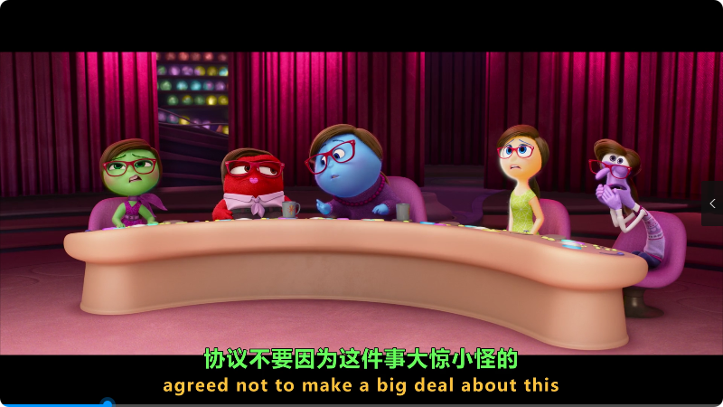

## 效果

- 处理视频：InsideOut2.mkv（头脑特工队2）
- 视频时长：01:36:20
- 电脑配置：
   - CPU：AMD Ryzen 7 2700X，8核16线程
   - 显卡：RTX3060 Ti，8G
   - 内存：DDR4，32G
- 助手主要配置：
   - Standalone Faster-Whisper-XXL r245.2
   - 本地 Whisper 模型: large-v2
   - 运行设备：cuda
   - 静音过滤：不选择
   - 消除背景音乐：选择
   - 翻译模式：精细意译
   - 源语言：自动
   - 目标语言：简体中文
   - LLM配置：硅基流动，THUDM/glm-4-9b-chat (免费)
   - 字幕合成：硬合成到视频文件
- LLM费用：0元（78459 tokens）
- 处理时长：总时长为 48:21
   - 开始时间：22:11:06
   - Whisper转录完成：22:25:03
   - 翻译完成：22:34:09
   - 结束时间：22:59:27
   - 总时长：48:21
   - 转录识别时长: 13:57
   - 翻译时长: 09:06
   - 合成时长: 25:18
- 部分字幕内容：
```
1
00:01:19,840 --> 00:01:22,960
让我们来打场曲棍球吧
Let's play some hockey

2
00:01:30,380 --> 00:01:33,860
这是Joy，正在从Riley的脑海为你直播
This is Joy, coming to you live in Riley's mind

3
00:01:34,140 --> 00:01:38,160
我们今天期待和Foghorns进行一场伟大的冠军赛
And we're expecting a great championship today with the Foghorns

4
00:01:38,820 --> 00:01:40,100
Riley的球迷们
Riley fans

5
00:01:40,220 --> 00:01:43,400
站起来，制造一些噪音吧
get up on your feet and make some noise

6
00:01:44,080 --> 00:01:47,000
加油，Foghorns！我们一起加油，Foghorns
Go, Foghorns! Let's go, Foghorns

7
00:02:01,090 --> 00:02:04,610
现在，是时候向你的队伍打招呼了
Now it's time to greet your team

8
00:02:04,910 --> 00:02:05,270
Riley
Riley

9
00:02:06,470 --> 00:02:08,250
他在第13个赛季中
Playing in his 13th year and

10
00:02:08,250 --> 00:02:09,670
刚从罚球区出来
fresh from the penalty box

11
00:02:09,710 --> 00:02:12,710
头盔、护垫、护具，安全检查清单齐全
it's Riley's Anger! Let me at him

12
00:02:21,010 --> 00:02:25,110
Helmet, pads, gloves, safety checklist is complete

13
00:02:25,270 --> 00:02:27,290
从现在开始，应该一帆风顺……
It should be nothing but smooth sailing from. . 

14
00:02:27,290 --> 00:02:27,590
啊
Ah

15
00:02:27,690 --> 00:02:28,350
小心
Look out

16
00:02:29,570 --> 00:02:32,310
这就是恐惧，让瑞利保持警惕
And that's fear, keeping Riley on her toes

17
00:02:32,410 --> 00:02:33,990
我们得拿好我们的护齿器
We gotta get our mouth guard
```
- 视频截图：
   - 合成后的视频截图：
<table style="border-collapse: collapse; border: 1px solid black;">
  <tr>
    <td style="padding: 5px;background-color:#fff;"></td>
  </tr>
</table>