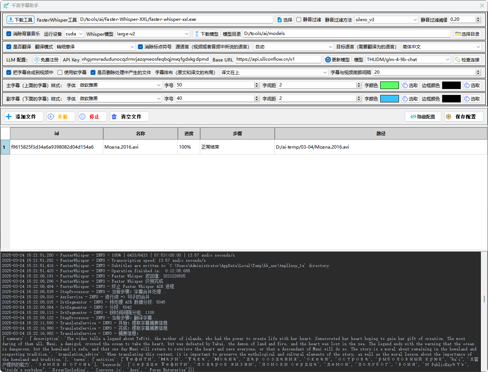
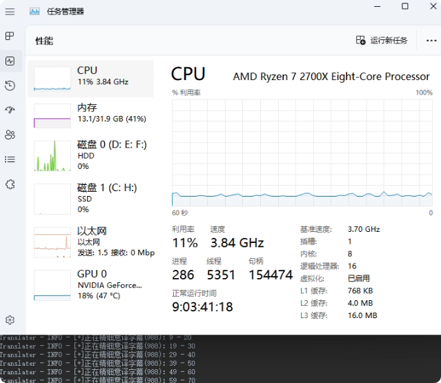
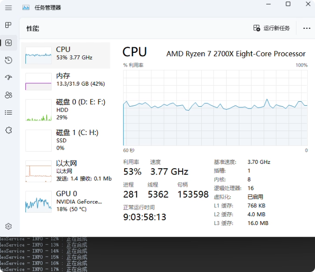
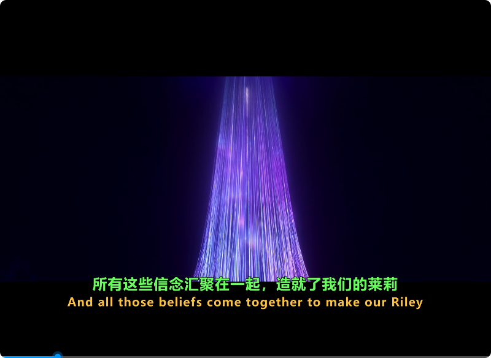

## 效果

- 处理视频：Moana.2016.avi（海洋奇缘(2016)）
- 视频时长：01:47:12
- 电脑配置：
   - CPU：AMD Ryzen 7 2700X，8核16线程
   - 显卡：RTX3060 Ti，8G
   - 内存：DDR4，32G
- 助手主要配置：
   - Standalone Faster-Whisper-XXL r245.2
   - 本地 Whisper 模型: large-v2
   - 运行设备：cuda
   - 静音过滤：不选择
   - 消除背景音乐：选择
   - 翻译模式：精细意译
   - 源语言：自动
   - 目标语言：简体中文
   - LLM配置：硅基流动，THUDM/glm-4-9b-chat (免费)
   - 字幕合成：硬合成到视频文件
- LLM费用：0元（95340 tokens）
- 处理时长：总时长为 24:54
   - 开始时间：15:08:37
   - Whisper转录完成： 15:22:09
   - 翻译完成：15:26:44
   - 结束时间：15:33:31
   - 转录识别时长: 13:32
   - 翻译时长: 04:35
   - 合成时长: 06:47
- 部分字幕内容：
```
1
00:00:51,040 --> 00:00:59,300
最初，世界上只有海洋
В самом начале был только океан

2
00:00:59,680 --> 00:01:03,200
直到岛屿之母诞生
пока не появилась мать островов

3
00:01:04,180 --> 00:01:05,440
特菲提
Тефити

4
00:01:06,580 --> 00:01:12,780
她的心拥有最大的天赋，它能创造生命
Ее сердце обладало величайшим даром, оно могло создавать жизнь

5
00:01:13,500 --> 00:01:17,180
特菲提将这份天赋分享给了世界
и Тефити делилась ею с миром

6
00:01:19,860 --> 00:01:24,700
但后来有些人开始寻求特菲提的心
Но потом некоторые стали искать сердца Тефити

7
00:01:25,040 --> 00:01:29,460
他们相信，掌握了心，就能掌握创造之力
они верили, что завладев сердцем, они завладеют и даром созидания

8
00:01:30,880 --> 00:01:38,300
其中最勇敢的一个飞跃了整个海洋
И однажды самый дерзкий из них перелетел через весь океан

9
00:01:38,680 --> 00:01:45,780
来夺取那颗心。他是一位半神，风神和海神
чтобы забрать сердце. Это был полубог ветров и морей

10
00:01:47,160 --> 00:01:49,760
他是一位战士
это был воин

11
00:01:51,120 --> 00:01:52,960
一个多才多艺的恶作剧大师
многолиткий проказник

12
00:01:54,740 --> 00:02:00,600
他借助自己的神奇钓钩变换面貌
Он менял обличие с помощью своего волшебного рыболовного крюка

13
00:02:02,200 --> 00:02:06,880
人们称他为摩阿伊
и звали его Мауи
```
- 视频截图：
   - 助手处理界面：
<table style="border-collapse: collapse; border: 1px solid black;">
  <tr>
    <td style="padding: 5px;background-color:#fff;"></td>
  </tr>
</table>  
   - 资源占用--Whisper转录：
<table style="border-collapse: collapse; border: 1px solid black;">
  <tr>
    <td style="padding: 5px;background-color:#fff;"></td>
  </tr>
</table>  
   - 资源占用--翻译：
<table style="border-collapse: collapse; border: 1px solid black;">
  <tr>
    <td style="padding: 5px;background-color:#fff;"></td>
  </tr>
</table>  
   - 资源占用--合成：
<table style="border-collapse: collapse; border: 1px solid black;">
  <tr>
    <td style="padding: 5px;background-color:#fff;"></td>
  </tr>
</table>  
   - 合成后的视频截图：
<table style="border-collapse: collapse; border: 1px solid black;">
  <tr>
    <td style="padding: 5px;background-color:#fff;"></td>
  </tr>
</table>  


